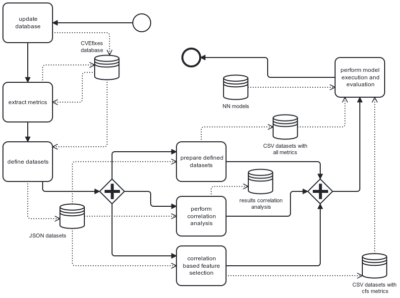
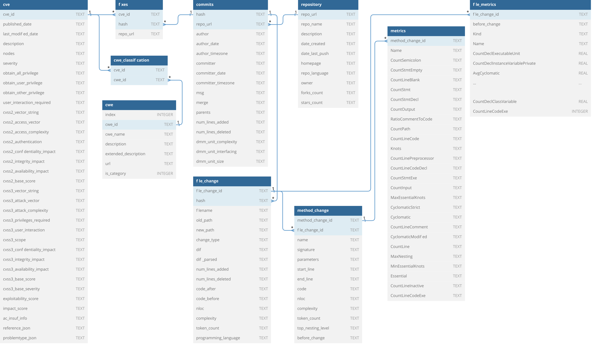

# Predicting Vulnerabilities with Software Metrics: What does not work

This repository contains the code for the paper with the same title "Predicting Vulnerabilities with Software Metrics: What does not work". We provided a pipeline to download the dataset, perform the metrics calculation and evaluate the results.
An overview of the pipeline provides the following picture:

The code is authored by Anonymous.

## Publication
This project is provided as part of a publication. A citation is always appreciated:
```bibtex
@inproceedings{article,
  author={Anonymous authors},
  booktitle={2024 Joint 5th International Workshop on Engineering and Cybersecurity of Critical Systems and 2nd International Workshop on Software Vulnerability Management (SVM)}, 
  title={Predicting Vulnerabilities with Software Product Metrics: What does not work}, 
  year={2023},
  volume={},
  number={},
  pages={},
  doi={tbd}
  }
```

## Data Source
We use the [CVE database by Mitre Corp.](https://cve.mitre.org/) and the download pipeline by Bhandari et al. from [GitHub](https://github.com/secureIT-project/CVEfixes).

### General Informations
- Original dataset of [CVEfixes](https://zenodo.org/record/4476564#.Y9fYnGGZNhF) from 9 June 2021
- Integrated [Toolkit](https://github.com/secureIT-project/CVEfixes) for processing new dataset up to date
- Published [paper](https://dl.acm.org/doi/pdf/10.1145/3475960.3475985) of CVEfixes
- New dataset of CVEfixes from 7 March 2023 can be found on ...

### Prerequisites for collecting the Dataset

1. Pull the repository of CVEfixes from GitHub.com to a folder named CVEfixes-main:
    `git pull https://github.com/secureIT-project/CVEfixes`

2. Create a conda environment via the following command:

    `conda create --name cveFixesPipeline python==3.9.0 pandas==1.2.4 numpy==1.19.2 requests==2.24`

3. Activate the environment via the following command:

    `conda activate cveFixesPipeline`

4. Install missing dependencies with the following commands:

    `pip install PyGithub==1.54`
    `pip install guesslang==2.0.3`

5. Use the following command to check the versions of the dependencies contained in this [file](/CVEfixes-main/requirements.txt) (ignore jupyter, seaborn and matplotlib):

    `pip show <dependency>`

6. Follow the instructions of this [file](/CVEfixes-main/INSTALL.md#recollecting-the-cvefixes-dataset-from-scratch). Note that the environment must be activated to perform the process of acutalizing the dataset.

## Project Structure
This project consists of the following main parts as python modules:

- **config** - Including general and tool specific information (e. g. file destinations)
- **CVEfixes-main** - Integration of the githb project github.com/secureIT-project/CVEfixes
- **metric_extraction** - Module for metric extraction via Analizo and Understand
- **data_preprocessing** - Module for generating preprocessed datasets from via Analizo and Understand extracted metrics
- **correlation_analysis** - Module to perform correlation analysis on the datasets
- **feature_Selection** - Module for correlation based feature selection on the datasets
- **models** - Module to define models based on neuronal network
- **centralized_execution** - Module for execution and evaluation of defined models in combination with the computed datasets
- **cvefixes_queries** - SQL queries for filtering the CVEFixes dataset
- **tools** - Module to provide all functions together separated by the different tools

## Using CVEfixes-pipeline

All functionalities of this project are provided by bash functions, which are implemented in the file *main.py*. You can use the following commands to perform the described tasks.

### Update the CVEfixes databes

    ./cvefixes-pipeline.sh --updateDatabase

With this command the CVEfixes database will be updated to the current date. After that a python script will explorate new statistics of this dataset. This statistics can be found in the folder *output/dataset_exploration/*.

Database layout after updating and execution of the metric tools:


### Extract metrics via analizo, understand or both

    ./cvefixes-pipeline.sh --extractMetrics [analizo|understand|all]

This command generates metrics for the current CVEfixes database. With the argument analizo, understand or all you can select the tool for metric extraction. If you select all, both tools will be executed for the dataset. After this task is done, the extracted metrics can be found in the CVEfixes database. These metrics are stored in separate database tables called *file_metrics_analizo* and *file_metrics_understand* and are referenced by *file_change_id* to corresponding *file_change* database entries.

### Preprocess dataset
    ./cvefixes-pipeline.sh --preprocessDataset [analizo|understand|combined|all]

This command prepares datasets with all extracted metrics for machine learning tasks. Firstly, JSON files with informations for every observed file change will be generated in the */output/* directory. After that the dataset will be splitted into train, test and validation data. This datasets can be found in the directories */output/understand_all/*, */output/analizo_all/* and */output/combined_all/*.

### Correlation analysis
    ./cvefixes-pipeline.sh --correlationAnalysis [analizo|understand|combined|all]

This command performs a correlation analysis on the selected datasets. Therefore the correlation methods of pearson, spearman and kendall will be apllied and significance tests like the T-test and the K-S-test will be executed. All results of the correlation analysis will be stored as SVG heatmap files and as JSON files for the siginificance tests. The outcomes will be stored in the directories */output/understand/*, */output/analizo/* and */output/combined/*.

### Correlation based feature selection
    ./cvefixes-pipeline.sh --featureSelection [analizo|understand|combined|all]

This command performs a correlation based feature selection on the selected dataset with pearson as correlation method. The selection will be executed for binary vulnerability classification and the estimation of the vulnerability score. Therefore the outcome of this feature selections will be stored in the directories */output/understand_cfs_vul/*, */output/understand_cfs_score/*, */output/analizo_cfs_vul/*, */output/analizo_cfs_score/*, */output/combined_cfs_vul/* and */output/combined_cfs_score/*.

### Model execution
    ./cvefixes-pipeline.sh --performModelExecution [analizo|understand|combined|all]

With this functions the defined model can be executed in combination with the generated datasets. For this command several optional arguments can be passed, which are described in the following listing.

- `--model [L|M|S|all]` for selecting the neuronal network which are categorized by the sizes large, medium and small. If you select the argument all, then all different models will be executed.
- `--subset [all|cfs|both]` for selecting the dataset subset. The argument all represents the resulting dataset from the preprocessing step. The argument cfs represent the generate subset from correlation based feature selection.
- `--type [vul|score|all]` for selecting the machine learning task. The argument vul performs the model execution for binary vulnerability classification and the argument score will perform the model execution for the estimation of the vulnerability score.
